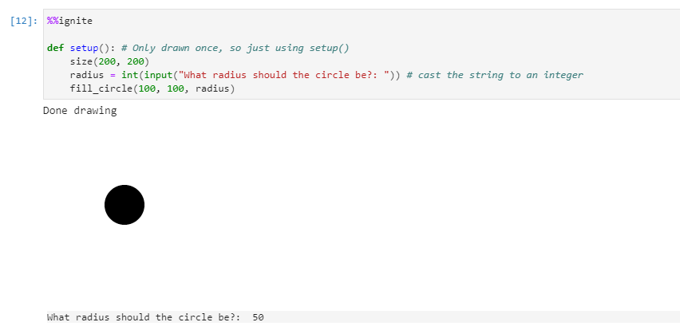

*Below you will find a list of all information necessary to take user input within spark.*

All of the examples below assume you have the boilerplate from [the notebook setup](../#boilerplate) in your code


### Mouse position

To get the current mouse position you can use the following variables:

- mouse_x: (int) The value of the x position of the mouse
- mouse_y: (int) The value of the y position of the mouse


**Example(s):**

*Drawing a circle at the mouse position constantly (remember it will draw over itself over and over again and leave a trail):*

```python
%%ignite

def setup():
    size(200, 200)

def draw():
    fill_circle(mouse_x, mouse_y, 25)
```

Results in:


### Mouse pressed

To find out if the mouse has been pressed you can use the variable:

- mouse_is_pressed: (bool) True if the mouse has been pressed, otherwise False


**Example(s):**

*Rectangle will be red if the mouse has been pressed, otherwise it will be blue*

```python
%%ignite

def setup():
    size(200, 200)

def draw():
    if mouse_is_pressed:
        fill_style("red")
    else:
        fill_style("blue")

    fill_rect(mouse_x, mouse_y, 20, 20)
```

Results in:


### Getting text from user

To ask the user for an answer to a question you can use:

```python
input(message)
```

Keep in mind, whatever the user types in will **always** be a string. See the second example for how to convert to other types.

**Parameters**

- message: (str) The text you want to show the user when asking for input


**Example(s):**

*Ask the user for their name, then display it to the screen:*

```python
%%ignite

def setup(): # Only drawn once, so just using setup()
    size(200, 200)
    name = input("What is your name?: ")
    text(name, 100, 100)
```

which results in:


*Ask the user for a radius. We need to convert the string to an integer, we can do this using int(). Draw a circle of that radius at (100, 100):*

```python
%%ignite

def setup(): # Only drawn once, so just using setup()
    size(200, 200)
    radius = int(input("What radius should the circle be?: ")) # cast the string to an integer
    fill_circle(100, 100 radius)
```

which results in:


