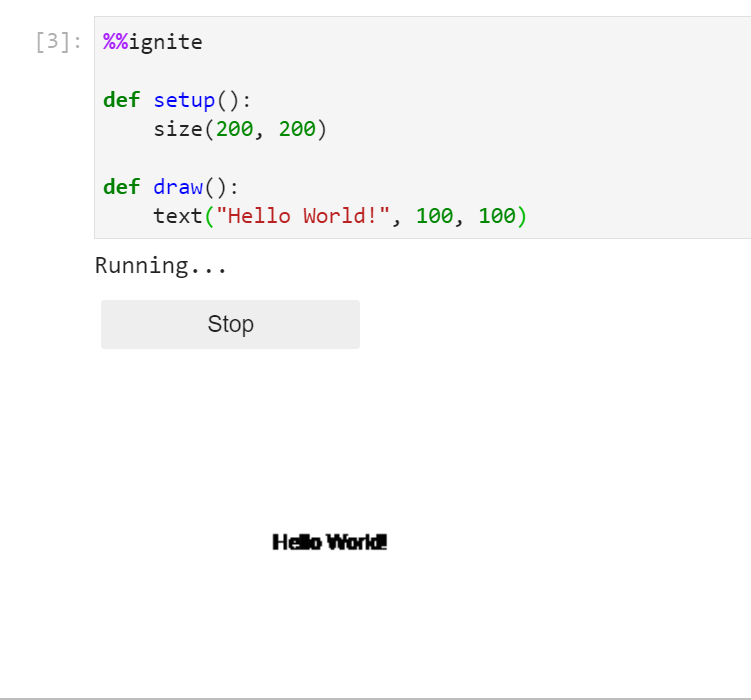
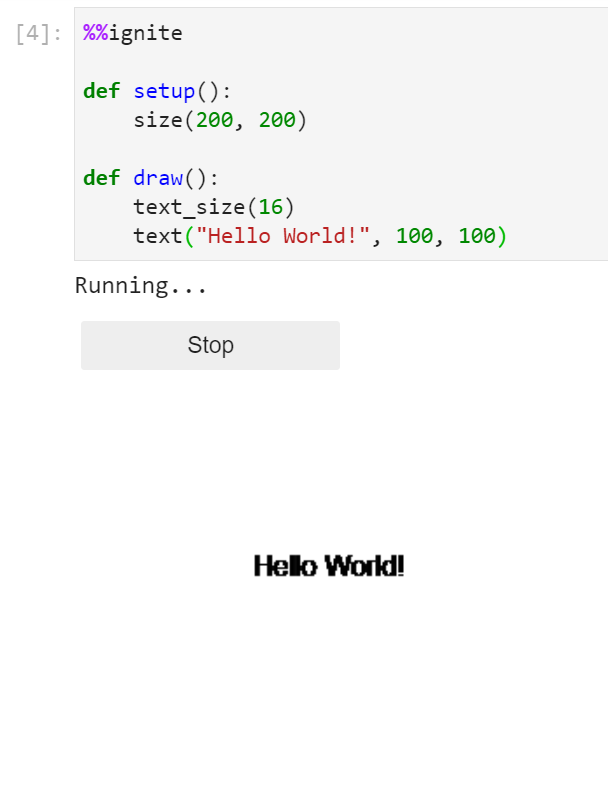

*Below is a list of all of the shapes, and text available for drawing within spark.*

All of the examples below assume you have the boilerplate from [the notebook setup](../#boilerplate) in your code

### Rectangle

To create a rectangle use:

```python
fill_rect(x, y, w, l)
```

**Parameters**

- x: (int or float) The value of the x position of the rectangle
- y: (int or float) The value of the y position of the rectangle
- w: (int or float) The width of the rectange
- l: (int or float) The length of the rectange

**Example(s):**

*Creating a rectangle at (100, 100) with a width of 75, and length of 50*

```python hl_lines="7"
%%ignite

def setup():
    size(200, 200)

def draw():
    fill_rect(100, 100, 75, 50)
```

Results in:


### Circle

To create a circle use:

```python
fill_circle(x, y, r)
```

**Parameters**

- x: (int or float) The value of the x position of the rectangle
- y: (int or float) The value of the y position of the rectangle
- d: (int or float) The diameter of the circle

Example(s):

*Creating a circle at (100, 100) with a diameter of 75*


```python hl_lines="7"
%%ignite

def setup():
    size(200, 200)

def draw():
    fill_circle(100, 100, 75)
```

Results in:


### Text

To create text in your drawing use:

```python
text(message, x, y)
```

**Parameters**

- message: (str) The text you want to draw
- x: (int or float) The value of the x position of the text
- y: (int or float) The value of the y position of the text


Example(s):

*Creating some text at (100, 100)*


```python hl_lines="7"
%%ignite

def setup():
    size(200, 200)

def draw():
    text("Hello World!", 100, 100)
```

Results in:



#### Change text size

To change the size of your text use:

```python
text_size(s)
```

**Parameters**

- s: (int or float) The size you want to make your text


Example(s):

*Creating some text at (100, 100), that is 16pt font*


```python hl_lines="7"
%%ignite

def setup():
    size(200, 200)

def draw():
    text_size(16)
    text("Hello World!", 100, 100)
```

Results in:


